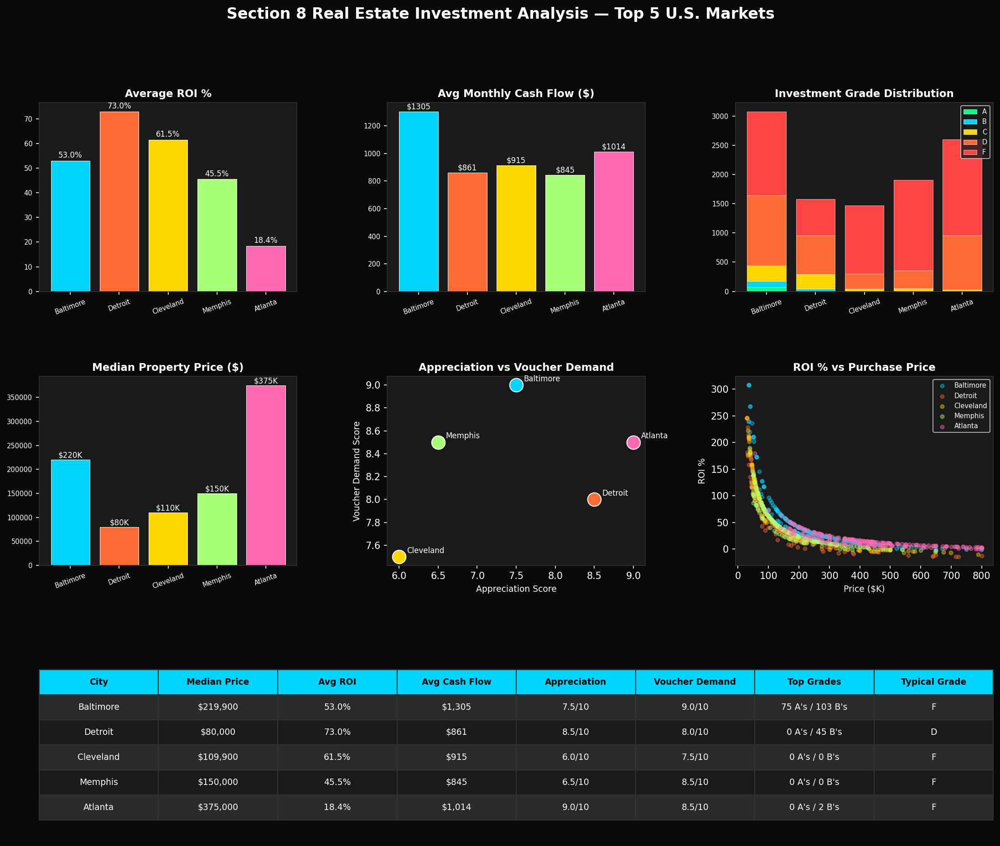

# Section 8 ROI Analyzer

### AI-Powered Real Estate Investment Screening for the Top 5 U.S. Section 8 Markets

**Live Demo:** [Try it on Hugging Face](https://huggingface.co/spaces/ColeTrainCodes/section8-roi-analyzer)  
**Built by:** ColeTrainCodes | [GitHub](https://github.com/ColeTrainCodes007)

---

## What This Is

Section 8 is one of the most overlooked wealth-building strategies in real estate. The U.S. government guarantees your rent payment every single month through the Housing Choice Voucher program — regardless of what your tenant does. You don't chase rent. The check comes from HUD.

The problem is finding the right properties in the right markets. Most investors either don't know where to look or spend hours manually researching markets, running numbers, and comparing cities. This tool does all of that instantly.

Enter your budget, pick a city, and get back a ranked list of the best Section 8 investment properties — sorted by ROI, cash flow, and long-term appreciation potential.

---

## Live Demo

[Click here to use the app](https://huggingface.co/spaces/ColeTrainCodes/section8-roi-analyzer)

Input your:
- Target city
- Max purchase price
- Number of bedrooms
- Down payment percentage

Get back:
- Top 10 ranked properties by investment score
- Monthly cash flow estimate (government guaranteed)
- ROI percentage
- Investment grade (A through F)
- Full market comparison across all 5 cities

---

## What The Data Shows

After analyzing 10,645 real property listings across 5 cities using 2024 HUD Fair Market Rent data, here is what the numbers say:

| City | Median Price | Avg ROI | Avg Cash Flow | Appreciation | Best For |
|---|---|---|---|---|---|
| Detroit | $80,000 | 73.0% | $861/mo | 8.5/10 | Highest ROI, lowest entry |
| Cleveland | $109,900 | 61.5% | $915/mo | 6.0/10 | Strong ROI, stable market |
| Baltimore | $219,900 | 53.0% | $1,305/mo | 7.5/10 | Best cash flow, 75 A-rated properties |
| Memphis | $150,000 | 45.5% | $845/mo | 6.5/10 | High voucher demand |
| Atlanta | $375,000 | 18.4% | $1,014/mo | 9.0/10 | Best appreciation, worst ROI |

**The takeaway:** Detroit and Cleveland are the best pure cash flow and ROI markets. Baltimore is the sweet spot for investors who want high monthly income. Atlanta is for long-term appreciation plays, not Section 8 cash flow.

---

## How The Investment Score Works

Every property is scored on 4 weighted factors:

| Factor | Weight | What It Measures |
|---|---|---|
| ROI % | 40% | Return on your invested capital after all expenses |
| Appreciation Potential | 25% | Likelihood of property value increasing over 3-5 years |
| Section 8 Voucher Demand | 20% | How many voucher holders are looking vs available units |
| Monthly Cash Flow | 15% | Actual dollars in your pocket every month after expenses |

Properties are then graded A through F. An A-rated property means strong returns across all four factors. A Detroit 3BR at $30K-$80K with $1,600+/month in guaranteed government rent is a textbook A.

---

## The Real Money: What This Could Become

This is version 1. It works. But the real version of this product — the one you could charge $99/month for — looks like this:

### Real-Time AI Market Monitor

Instead of a static dataset, imagine an AI that runs 24/7 and continuously pulls from:

**Property Data Sources:**
- Zillow API — live listing prices, price cuts, days on market
- Redfin API — sold prices, price history, neighborhood trends
- MLS feeds — new listings before they hit the public market
- Auction.com — distressed and foreclosure properties
- HUD Home Store — government-owned properties at discount

**Government & Economic Data:**
- HUD Fair Market Rent updates (published annually, tracked in real time)
- Census Bureau — population growth, income shifts, demographic trends
- Bureau of Labor Statistics — local employment data by metro
- Federal Reserve — interest rate changes affecting mortgage costs

**Neighborhood Intelligence:**
- Google Places API — new business licenses (coffee shops, gyms = gentrification signal)
- Crime API feeds — directional crime trend (declining = price appreciation incoming)
- Walk Score / Transit Score — infrastructure investment signals
- Building permit filings — developer activity in a zip code

**Section 8 Specific:**
- HUD Picture of Subsidized Households — voucher utilization rates by city
- Public Housing Authority waitlists — demand vs supply of vouchers
- Voucher payment standard updates by zip code

### What The AI Would Watch For

Every data point above gets weighted and monitored continuously. The system flags a property or neighborhood when it sees a combination of:

- Price just dropped 10%+ but rental demand is unchanged
- New business licenses up 15%+ in the last 6 months (early gentrification)
- Crime trending down 3 consecutive quarters
- HUD voucher waitlist growing (more demand than supply)
- Building permits up (developers moving in before retail buyers notice)
- Days on market increasing (buyers pulling back = negotiating leverage)
- Fair Market Rent increased (government just raised your guaranteed income)
- Employment rate improving locally (economic foundation strengthening)
- Population growing in the metro (long term demand driver)
- Property tax rate stable or declining (expense side improving)

When enough of these signals align on a single property or zip code, the system surfaces it as a high-probability opportunity — ranked against every other opportunity in the dataset in real time.

### The Business Model

**Tier 1 — Free:** Static analysis like this tool. Shows the concept, builds trust.

**Tier 2 — $49/month:** Weekly updated market reports for your chosen cities. Email alerts when a new A-rated property hits the market in your criteria.

**Tier 3 — $99/month:** Real-time monitoring. Instant push notification when a high-score property is listed. Full AI market monitor running continuously across all tracked cities.

**Tier 4 — $299/month (Institutional):** API access for real estate funds and investment firms. Custom city coverage. White-label reporting.

The target customer is the individual investor who owns 1-10 rental properties and wants to scale. They already understand Section 8. They just need better data faster than everyone else. That is exactly what this tool provides.

---

## Tech Stack

- Python
- Pandas / NumPy
- Matplotlib
- Gradio
- Kaggle (dataset + compute)
- Hugging Face Spaces (deployment)
- HUD Fair Market Rent API (government data)

**For the real-time version:**
- Zillow API / Redfin API
- Google Places API
- HUD Data API
- Apache Airflow (pipeline scheduling)
- PostgreSQL (live data storage)
- FastAPI (backend)
- React (frontend dashboard)

---

## Data Sources

| Source | Data Used |
|---|---|
| [USA Real Estate Dataset — Kaggle](https://www.kaggle.com/datasets/ahmedshahriarsakib/usa-real-estate-dataset) | 2.2M property listings |
| [HUD Fair Market Rents 2024](https://www.huduser.gov/portal/datasets/fmr.html) | Government guaranteed rent by bedroom/city |
| [Tax Foundation — Property Tax Rates](https://taxfoundation.org/data/all/state/property-taxes-by-state-county-2024/) | Annual property tax rates by city |

---

## Limitations

- Dataset is a static snapshot, not live data
- Property tax rates are city averages, not parcel-specific
- Does not account for HOA fees, flood insurance, or rehab costs
- Appreciation scores are research-based estimates, not predictive model outputs
- Cash flow estimates assume standard Section 8 tenancy — actual results vary

---

## Disclaimer

This tool is for educational and research purposes only. It is not financial advice. Always conduct full due diligence, consult a licensed real estate professional, and verify all figures independently before making any investment decision.

---

*This project is part of a portfolio demonstrating applied data science and AI in real-world financial use cases.*
